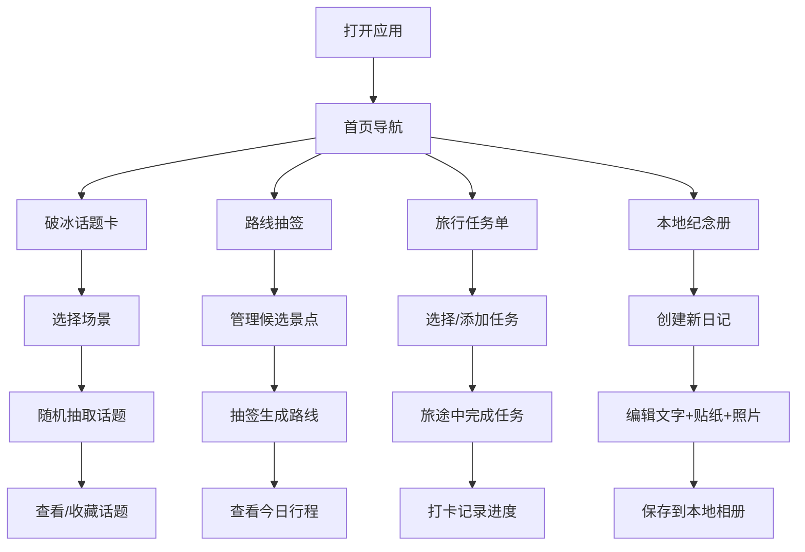

## 1. 产品概述

无网旅行破冰包是一款专为背包客和自由行旅行者设计的离线轻量工具集合，解决用户在无网络环境下的社交破冰、行程决策、互动记录等需求。

- 核心价值：让旅途不再孤单，用轻量互动工具连接人与风景
- 目标用户：背包客、独自旅行者、青年旅舍住客、拼车拼桌旅伴

## 2. 核心功能

### 2.1 用户角色

| 角色 | 注册方式 | 核心权限 |
|------|----------|----------|
| 旅行者 | 无需注册，纯前端应用 | 使用全部功能，本地存储数据 |

### 2.2 功能模块

1. **首页**：功能入口导航、使用引导、数据状态提示
2. **破冰话题卡**：多场景话题库、随机抽取、收藏功能
3. **路线抽签**：候选景点管理、随机组合生成、今日行程展示
4. **旅行任务单**：任务分类库、自定义任务、完成打卡、进度追踪
5. **本地纪念册**：日记编辑、贴纸装饰、照片上传、日记列表

### 2.3 页面详情

| 页面名称 | 模块名称 | 功能描述 |
|----------|----------|----------|
| 首页 | 导航卡片 | 四大功能入口卡片，带图标和场景说明 |
| 破冰话题卡 | 场景选择 | 旅伴/民宿/拼桌三种场景切换 |
| 破冰话题卡 | 话题抽取 | 随机翻牌效果展示话题，支持收藏 |
| 破冰话题卡 | 收藏夹 | 查看已收藏的话题 |
| 路线抽签 | 景点管理 | 添加、编辑、删除候选景点 |
| 路线抽签 | 抽签生成 | 摇一摇/按钮随机抽取 N 个景点组成今日路线 |
| 路线抽签 | 行程展示 | 展示生成的路线，支持重新抽取 |
| 旅行任务单 | 任务库 | 拍照/观察/品尝/记录四类预设任务 |
| 旅行任务单 | 自定义任务 | 用户添加个性化任务 |
| 旅行任务单 | 打卡面板 | 任务勾选完成，显示完成进度 |
| 本地纪念册 | 日记编辑 | 文字输入、日期地点设置 |
| 本地纪念册 | 贴纸装饰 | 预设贴纸拖放到日记页面 |
| 本地纪念册 | 照片上传 | 本地图片上传嵌入日记 |
| 本地纪念册 | 日记列表 | 按时间线展示所有日记 |

## 3. 核心流程

## 4. 用户界面设计

### 4.1 设计风格
- **主色调**：温暖琥珀色 #f59e0b 代表旅途阳光，搭配大地绿 #065f46 代表自然探索
- **辅助色**：米白色 #fef3c7 背景，深棕色 #78350f 文字，营造手账/旅行日志质感
- **按钮风格**：圆角矩形，微阴影，hover 时轻微上浮
- **字体**：标题使用 "ZCOOL KuaiLe" 手写风格字体，正文使用 "Noto Sans SC" 清晰易读
- **布局风格**：卡片式布局，大量留白，手绘边框和纸质纹理背景
- **图标风格**：线性图标搭配手绘风格 emoji 贴纸

### 4.2 页面设计概述

| 页面名称 | 模块名称 | UI 元素 |
|----------|----------|----------|
| 首页 | 导航卡片 | 渐变背景卡片、emoji 大图标、入场动画、交错显示 |
| 破冰话题卡 | 话题卡 | 翻牌动画、卡片阴影、纸质纹理、收藏按钮 |
| 路线抽签 | 抽签动效 | 摇一摇动画、景点卡片飞出、路线连线动画 |
| 旅行任务单 | 任务卡片 | 复选框动画、完成打勾特效、进度条渐变色 |
| 本地纪念册 | 日记画布 | 可拖拽贴纸、图片上传预览、便签风格文字框 |

### 4.3 响应式
- 移动端优先设计，适配 iPhone SE 到 iPad Pro
- 触摸交互优化，按钮最小 44x44px
- 横屏模式下自动调整布局为两栏
- 所有数据本地存储，完全离线可用

### 4.4 视觉动效
- 页面切换：淡入淡出 + 轻微滑动
- 卡片翻转：3D 翻转动画展示话题
- 抽签效果：快速切换后缓动停在结果
- 任务完成：打勾缩放动画 + 轻微震动反馈
- 贴纸拖拽：跟随手指 + 释放吸附效果
