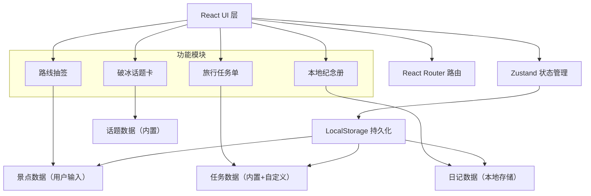

## 1. 架构设计



## 2. 技术描述

- **前端**：React@18 + TypeScript + Vite@5 + TailwindCSS@3
- **状态管理**：Zustand（轻量，支持持久化）
- **路由**：React Router DOM@6
- **图标**：Lucide React
- **数据持久化**：LocalStorage（zustand-persist 中间件）
- **后端**：无（纯前端离线应用）
- **构建工具**：Vite

## 3. 路由定义

| 路由 | 页面 | 用途 |
|------|------|------|
| / | Home | 首页导航 |
| /icebreaker | Icebreaker | 破冰话题卡 |
| /route | RouteDraw | 路线抽签 |
| /tasks | TravelTasks | 旅行任务单 |
| /journal | Journal | 本地纪念册 |
| /journal/new | JournalEditor | 新建日记 |
| /journal/:id | JournalEditor | 编辑日记 |

## 4. 数据模型

### 4.1 话题数据 (内置)
```typescript
interface Topic {
  id: string;
  content: string;
  category: 'companion' | 'hostel' | 'dining';
  difficulty: 'easy' | 'medium' | 'deep';
}
```

### 4.2 景点数据
```typescript
interface Attraction {
  id: string;
  name: string;
  description?: string;
  duration?: number; // 预计时长（分钟）
  createdAt: number;
}
```

### 4.3 任务数据
```typescript
interface TravelTask {
  id: string;
  title: string;
  category: 'photo' | 'observe' | 'taste' | 'record';
  icon: string;
  completed: boolean;
  completedAt?: number;
  isCustom: boolean;
}
```

### 4.4 日记数据
```typescript
interface JournalEntry {
  id: string;
  title: string;
  content: string;
  date: string;
  location: string;
  photos: string[]; // base64 数据
  stickers: StickerPlacement[];
  createdAt: number;
  updatedAt: number;
}

interface StickerPlacement {
  id: string;
  type: string;
  x: number;
  y: number;
  scale: number;
  rotation: number;
}
```

### 4.5 应用状态
```typescript
interface AppState {
  // 破冰话题
  favoriteTopics: string[];
  
  // 路线抽签
  attractions: Attraction[];
  currentRoute: string[] | null;
  
  // 旅行任务
  tasks: TravelTask[];
  activeDate: string;
  
  // 本地纪念册
  journals: JournalEntry[];
}
```
